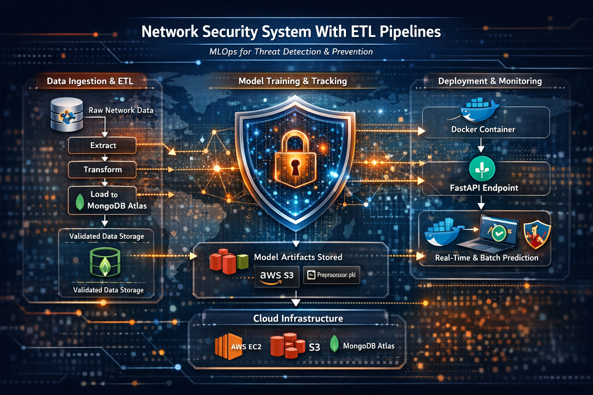
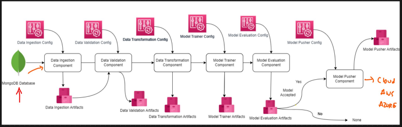
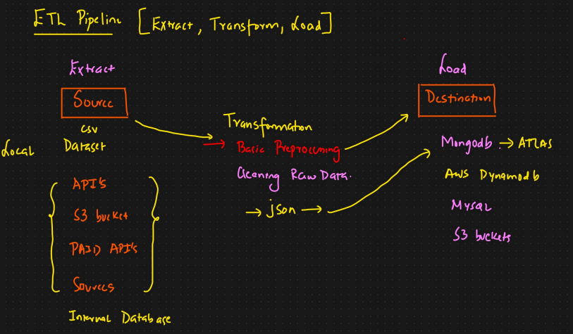
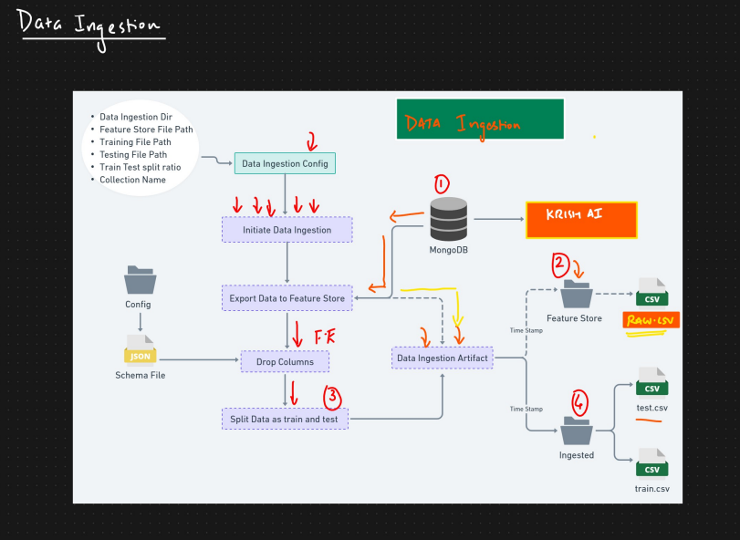
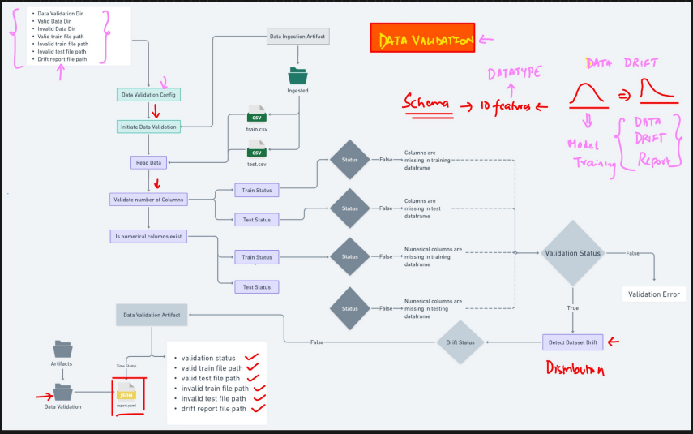
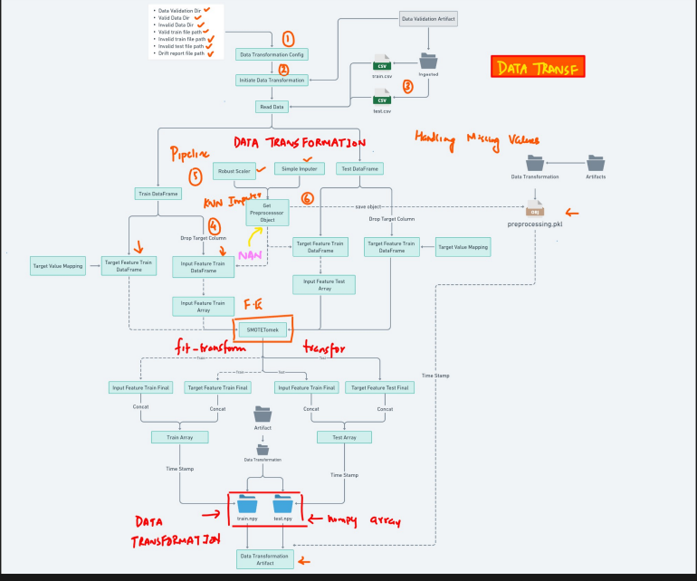

# Building Network Security System — MLOps Project with ETL Pipelines

## Overview

This project implements an **end-to-end Machine Learning Operations (MLOps) solution** focused on building a **network security system** that detects malicious network activity (e.g., phishing attacks) using supervised machine learning, structured ETL (Extract-Transform-Load) pipelines, automated workflows, artifact tracking, and cloud deployment. The system is packaged for scalable real-world deployment with clear automation and monitoring practices, emphasizing both engineering rigor and operational readiness.




---

## Table of Contents

1. [Business Value](#1-business-value)
2. [Architecture Summary](#2-architecture-summary)
3. [Core Features](#3-core-features)
4. [Data Engineering (ETL)](#4-data-engineering-etl)
5. [Machine Learning Lifecycle](#5-machine-learning-lifecycle)
6. [Deployment & MLOps Practices](#6-deployment--mlops-practices)
7. [Tech Stack](#7-tech-stack)
8. [Usage](#8-usage)
9. [Project Structure](#9-project-structure)
10. [Future Enhancements](#10-future-enhancements)
11. [Credits & References](#11-credits--references)

---

## 1. Business Value

This system delivers measurable value to organizations that must protect users and systems from network threats:

**Detect Threats Automatically**  
- The ML model automates identification of malicious network data, reducing manual workload and improving detection speed.

**Operationalize Security Intelligence**  
- Structured ETL and deployment pipelines operationalize analytics into production environments.

**Scalable & Reproducible**  
- With containerized MLOps architecture, experiments, models, and deployments can scale, be versioned, audited, and reused.

**Reduced Risk / Improved SLAs**  
- Faster, reliable predictions help secure customer environments and improve service level agreements (SLAs) for threat response.

**Cost Efficiency**  
- Automated pipelines reduce human intervention, lower maintenance overhead, and support continuous delivery practices typical in enterprise settings.

---

## 2. Architecture Summary


The project’s end-to-end architecture typically follows these high-level layers:

```text
                    Raw Data Source
                           ↓
                    ETL Pipeline (Python)
                           ↓
                MongoDB Atlas (Structured Storage)
                           ↓
                Model Training / Evaluation
                           ↓
              Experiment Tracking (MLflow / DagsHub)
                           ↓
              Model & Artifact Storage (AWS S3)
                           ↓
      Deployment (AWS EC2 / Docker / FastAPI / UI)
                           ↓
                   Real-Time / Batch Serving
```

Components coordinate to ensure reproducibility from raw data → prediction.





---

## 3. Core Features

### ETL Pipeline

- Extracts raw data from source(s)  
- Validates schema & data consistency  
- Transforms data into structured formats  
- Loads clean data into a MongoDB instance for training and serving

### Machine Learning

- Trains classification models (e.g., Logistic Regression, Random Forest, etc.)  
- Evaluates model performance and selects best performers  
- Generates artifacts (e.g., `model.pkl`, `preprocessor.pkl`)

### Workflow Automation

- Batch prediction pipelines  
- Model retraining triggers  
- Versioned artifact management with MLflow and DagsHub

### Deployment

- Model served via API (FastAPI) or backend script  
- Docker containers for consistency  
- Hosted on AWS EC2, leveraging AWS S3 and other cloud services

### Data Storage & Versioning

- MongoDB Atlas for structured data  
- S3 buckets for artifact and experiment storage

---

## 4. Data Engineering (ETL)

The ETL pipeline is designed to:

**Extract**  
Load incoming network datasets (e.g., features describing URLs or traffic metadata).

**Transform**  
Validate data types, handle missing values, normalize and scale inputs.  
Build preprocessors for ML model input.

**Load**  
Persist transformed data in MongoDB for efficient querying and model training.



---

## 5. Machine Learning Lifecycle

The model lifecycle includes:

- **Training** using labeled data  
- **Cross-validation** and metric evaluation  
- **Artifact serialization** (model, preprocessors)  
- **Experiment tracking** (MLflow)  
- **Batch prediction pipeline** (for large datasets)  
- **Real-time prediction serving** (via API)

By logging experiments and artifacts, the system supports reproducibility and auditability.




---

## 6. Deployment & MLOps Practices

**Version Control**  
- GitHub repository structure supports modular code.

**CI/CD**  
- GitHub Actions for automated testing and container publishing.

**Containerization**  
- Docker images encapsulate all dependencies.

**Cloud Deployment**  
- AWS infrastructure (EC2, ECR, S3) for scalable production readiness.

---

## 7. Tech Stack

| Layer | Tools |
|-------|-------|
| Data Engineering | Python, Pandas, NumPy |
| Model Training | scikit-learn, TensorFlow or PyTorch |
| Storage | MongoDB Atlas |
| Experiment Tracking | MLflow, DagsHub |
| Cloud Infrastructure | AWS (EC2, S3, ECR) |
| Orchestration | CI/CD GitHub Actions |
| Deployment | FastAPI, Docker |

---

## 8. Usage

### Installation

```bash
git clone https://github.com/Alve-Haque/Building-Network-Security-System--MLOPS-Project-With-ETL-Pipelines
cd Building-Network-Security-System--MLOPS-Project-With-ETL-Pipelines
pip install -r requirements.txt
```

### Running ETL

```bash
python push_data.py      # push raw data
python main.py           # run full pipeline
```

### Serving API

```bash
uvicorn app:app --reload  # starts the API server
```

### Testing Database Connection

```bash
python test_mongodb.py
```

---

## 9. Project Structure

```
.github/                    CI/CD configurations  
Network_Data/              Source datasets  
data_schema/               Data validation schemas  
final_model/               Saved trained model artifacts  
logs/                      Pipeline logs  
networksecurity/           Core application code  
templates/                 UI templates (if any)  
valid_data/                Validated processed data  
Dockerfile                 Container definitions  
app.py                     API entrypoint  
main.py                    Pipeline orchestrator  
push_data.py               ETL ingestion script  
test_mongodb.py            DB connectivity tests  
mlflow.db                  Experiment tracking database  
```

---

## 10. Future Enhancements

- Add real-time streaming ingestion (Apache Kafka)  
- Enhance UI for prediction insights  
- Automate scheduled retraining  
- Integrate alerting dashboards for anomalous predictions

---

## 11. Credits & References

Project structure and implementation concepts are inspired by similar MLOps network security projects with ETL pipelines and best practices for model tracking and deployment on cloud platforms.
